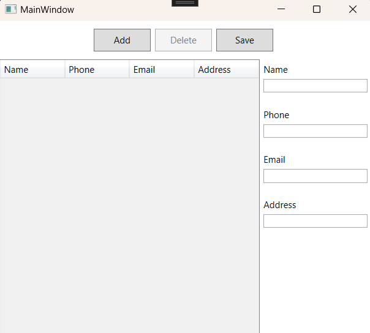

# Contacts Keeper GUI Showcase

## Description
This project is a showcase of the Contacts Keeper application's GUI design, created using WPF (Windows Presentation Foundation) and MVVM (Model-View-ViewModel) architecture. It highlights the user interface elements and design layout for managing contact information, without implementing full functionality.

## Preview

Explore the GUI design to understand the user experience and interface layout. This project serves as a visual reference and design example.

## Contributing
Suggestions for design improvements are welcome!